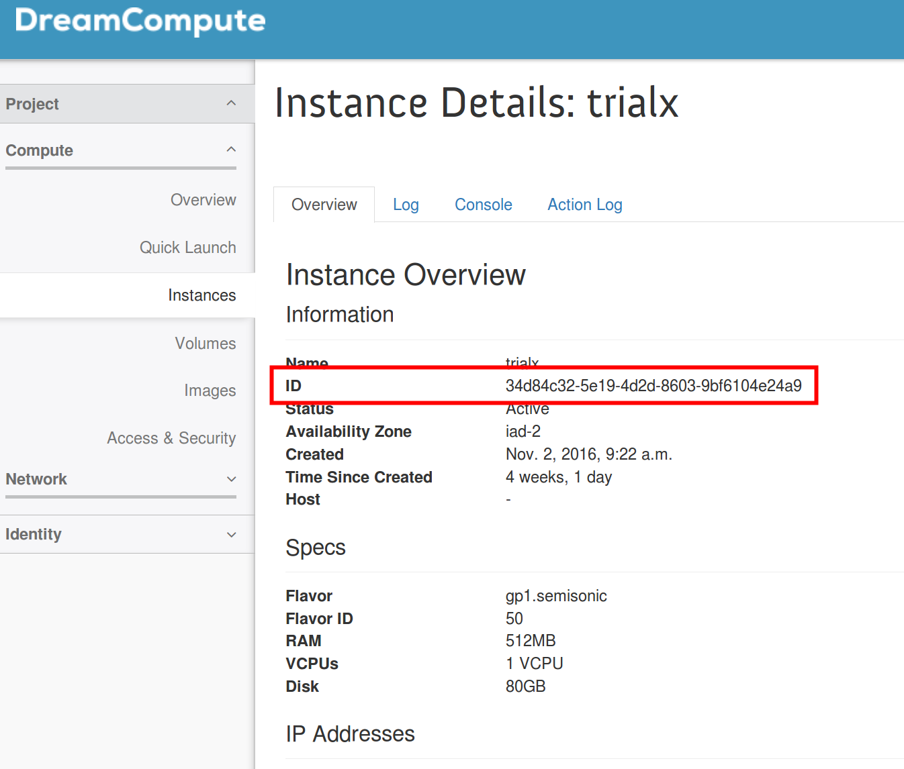

========================================
How to find the UUID of a virtual server
========================================

Every virtual server in DreamCompute gets assigned a unique identifier
called `UUID`, short for Universally Unique ID. This identifier is
sometimes requested by DreamHost Tech Support to precisely pinpoint a
virtual server. It can also be used to quickly refer to specific
instances when using the command line tools and the APIs.

Find the UUID using the web interface
-------------------------------------

The UUID appears in the web interface when clicking on the instance
name. The `Instance Overview` panel shows the `ID` of the instance.
Notice also the URL of the `Instance Overview` panel also includes
such ID.

Find the UUID using openstack client
------------------------------------

You can find the same information using the command line client
`openstack` with the command `server list`. The output will look
similar to:

.. code-block:: console

    [user@localhost]$ openstack --os-cloud iad2
    (openstack) server list
    +--------------------------------------+--------+--------+--------------------------------------------------------------+
    | ID                                   | Name   | Status | Networks                                                     |
    +--------------------------------------+--------+--------+--------------------------------------------------------------+
    | 34d84c32-5e19-4d2d-8603-9bf6104e24a9 | trialx | ACTIVE | public=2607:f298:5:101d:f816:3eff:fe22:b19a, 208.113.143.23  |
    +--------------------------------------+--------+--------+--------------------------------------------------------------+

The ID is the UUID you're looking for. Read `how to configure and use
openstack command line client <FIXME>`.

.. meta::
    :labels: compute nova openstack
